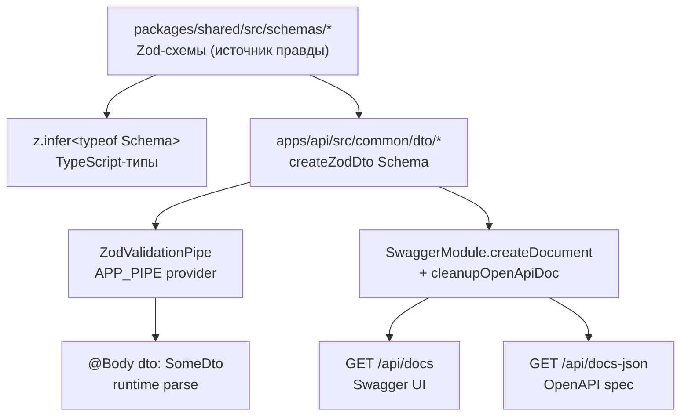

## Схемы, валидация и OpenAPI

Единый источник правды для всех DTO — Zod-схемы в `@exchange/shared`. Из них автоматически выводятся:

1. TypeScript-типы (через `z.infer`), которые шарятся между `apps/api` и `apps/web`.
2. Runtime-валидация входов в API — глобальный `ZodValidationPipe` из `nestjs-zod` валидирует `@Body/@Query/@Param`.
3. Документация OpenAPI и Swagger UI — `nestjs-zod` + `@nestjs/swagger` генерируют спеку из тех же схем.

Никаких ручных DTO-классов с декораторами `@ApiProperty` поверх Zod-полей. Меняешь схему — меняется и тип, и валидация, и документация.

## Поток



## Структура

```
packages/shared/src/schemas/
├── common.ts          # DecimalString, Uuid, Timestamp, enums
├── trading-pair.ts    # TradingPair
├── balance.ts         # Balance
├── order.ts           # Order, CreateMarketOrder, CreateLimitOrder, CreateOrder (discriminated union)
├── trade.ts           # Trade
├── account.ts         # Account, AccountSummary
├── ws-messages.ts     # KlineUpdate, TickerUpdate, OrderUpdate, BalanceUpdate, WSMessage
└── example.ts         # HealthResponse
```

DTO-классы для контроллеров — тонкие обёртки через `createZodDto`:

```ts
// apps/api/src/common/dto/account-summary.dto.ts
import { AccountSummarySchema } from '@exchange/shared';
import { createZodDto } from 'nestjs-zod';

export class AccountSummaryDto extends createZodDto(AccountSummarySchema) {}
```

В контроллере достаточно сослаться на DTO в сигнатуре и в `@ApiOkResponse`:

```ts
@Get('me')
@ApiOkResponse({ type: AccountSummaryDto })
async me(): Promise<AccountSummaryDto> { ... }
```

## Денежные значения на проводе

Все Decimal-поля (`free`, `locked`, `quantity`, `price`, ...) сериализуются как **строки**, не числа. Причина: PostgreSQL `Decimal(36, 18)` не помещается в JS `number` без потери точности. Схема `DecimalStringSchema` валидирует формат: только цифры и опциональная точка, без знака и экспоненты.

Арифметические операции над деньгами — через `decimal.js`. Никаких `+`, `-` на сырых числах.

В контроллере перед возвратом — явный `.toString()` на `Prisma.Decimal`-полях. См. `apps/api/src/account/account.controller.ts:23` для примера.

## Swagger UI и cookie-аутентификация

| Адрес                    | Что отдаёт          |
| ------------------------ | ------------------- |
| `/api/docs`              | Swagger UI (HTML)   |
| `/api/docs-json`         | OpenAPI 3.0 JSON    |

Аутентификация — httpOnly-cookie `account_id` (см. [auth.md](auth.md)). В Swagger UI она помечена как `cookieAuth`-схема. В `main.ts` включены опции `persistAuthorization` и `withCredentials`, поэтому cookie сохраняется между запросами в UI после первого ответа.

CORS настроен на origin `http://localhost:3000` (фронт) с `credentials: true` — переопределяется через `CORS_ORIGIN` в `.env`.

## Сборка `@exchange/shared`

`@exchange/shared` экспортирует **скомпилированный JS** (`./dist`), а не сырые `.ts`. Без этого Node ESM-резолвер не находит модуль на рантайме.

```bash
npm run build --workspace=@exchange/shared        # одноразовая сборка
npm run build:watch --workspace=@exchange/shared  # watch-режим для активной разработки схем
```

В корневом `package.json` это уже автоматизировано:

- `npm run dev:api` имеет `predev:api`-хук, который собирает shared перед стартом api.
- `npm run dev` запускает `dev:shared` (watch) параллельно с api+web — правки схем подхватываются без ручных команд.

## Где это лежит

- [`packages/shared/src/schemas/`](../packages/shared/src/schemas/) — Zod-схемы (источник правды).
- [`apps/api/src/common/dto/`](../apps/api/src/common/dto/) — DTO-классы через `createZodDto`.
- [`apps/api/src/app.module.ts`](../apps/api/src/app.module.ts) — `APP_PIPE: ZodValidationPipe` (глобальная валидация).
- [`apps/api/src/swagger.ts`](../apps/api/src/swagger.ts) — `DocumentBuilder`, `cleanupOpenApiDoc`, `SwaggerModule.setup('api/docs', ...)`.
- [`apps/api/src/main.ts`](../apps/api/src/main.ts) — bootstrap, CORS, вызов `setupSwagger(app)`.

## Известные ограничения

- **Output-валидация не включена.** `ZodValidationPipe` валидирует только вход. Для проверки структуры ответа против схемы есть `createZodSerializerInterceptor` из `nestjs-zod` (Zod 4 only) — не подключён, потому что преждевременно. Если ответ контроллера разойдётся со схемой, рантайм этого не поймает; поможет только TypeScript на этапе компиляции.
- **Имена схем в OpenAPI выводятся из имени DTO-класса.** Метаданные `.meta({ id: 'Foo' })` на shared-схемах overrides не работают после `createZodDto` — итоговое имя всегда `<DtoClassName>`. Вложенные объекты получают имя вида `<ParentDto><Field>` (например, `AccountSummaryDtoBalance`). Для целей UI читается, но если нужен идеальный ref — придётся обходить через ручной `@ApiProperty` или ждать поддержки в nestjs-zod.
- **Нужно ребилдить shared при правке схем.** Если api не видит новых полей — проверь, что `npm run build --workspace=@exchange/shared` отработал. Для удобства держи `build:watch` в соседнем терминале.
- **WebSocket-схемы пока без OpenAPI.** `WSMessageSchema` существует и используется на фронте/беке, но в Swagger не светится — REST OpenAPI не покрывает WS-протокол.
