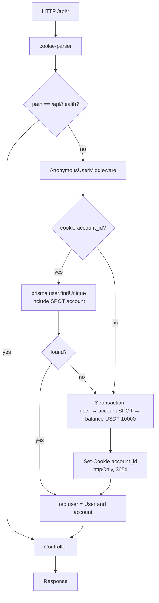

# Анонимная идентификация

Демо-биржа без регистрации. Каждый посетитель опознаётся по UUID в httpOnly-cookie `account_id`. На первом запросе сервер создаёт `User → Account(SPOT) → Balance(USDT 10000)` одной транзакцией и ставит cookie на 365 дней.

## Поток



## Cookie

| Атрибут     | Значение                          |
| ----------- | --------------------------------- |
| Имя         | `account_id`                      |
| Содержимое  | `User.id` (UUID)                  |
| `httpOnly`  | да                                |
| `sameSite`  | `lax`                             |
| `secure`    | только в production               |
| `maxAge`    | 365 дней, expiry не продлевается  |

Имя `account_id` — историческое; реально хранится `User.id`.

## Создание пользователя

Происходит атомарно через `prisma.$transaction` — частичных состояний быть не может:

1. `User` (id = uuid)
2. `Account` с `type = SPOT`
3. `Balance` с `asset = "USDT"`, `free = 10000`, `locked = 0`

Поле `Balance.locked` зарезервировано под лимитные ордера. Оно есть с MVP, чтобы не делать миграцию при добавлении лимитников.

## Использование в коде

```ts
@Get('me')
async me(@CurrentUser() user: CurrentUserType) {
  // user: User & { account: Account }
  // req.user уже подгружен middleware'ом
}
```

`@CurrentUser` читает `req.user` и бросает `UnauthorizedException`, если middleware не отработал (защита на случай криво настроенного роута).

## Исключения

- `/api/health` — middleware не применяется (через `MiddlewareConsumer.exclude('health')`).
- Всё остальное под `/api/*` — обязательно через middleware.

## Где это лежит

- [`apps/api/src/auth/anonymous-user.middleware.ts`](../apps/api/src/auth/anonymous-user.middleware.ts) — middleware
- [`apps/api/src/auth/current-user.decorator.ts`](../apps/api/src/auth/current-user.decorator.ts) — `@CurrentUser` + `CurrentUserType`
- [`apps/api/src/types/express.d.ts`](../apps/api/src/types/express.d.ts) — расширение `Express.Request.user`
- [`apps/api/src/app.module.ts`](../apps/api/src/app.module.ts) — регистрация middleware с `exclude('health').forRoutes('*')`
- [`apps/api/prisma/schema.prisma`](../apps/api/prisma/schema.prisma) — модели `User`, `Account`, `Balance`

## Известные ограничения

- **Гонка на первом визите.** Параллельные запросы без cookie (например, 3 таба, открытых одновременно) создадут 3 разных `User`. В браузере останется cookie от последнего ответа, остальные станут осиротевшими записями. Для демки терпимо: пользователь и так может получить новые $10000 очисткой cookies.
- **Expiry не продлевается.** Cookie живёт 365 дней с момента создания. Через год пользователь получит новый аккаунт.
- **Замена identity при потере аккаунта.** Если по cookie найден `User`, но без SPOT `Account`a, middleware молча создаст нового `User` и заменит cookie. Текущая схема такое состояние не допускает (account создаётся в той же транзакции), но учитывай при будущих миграциях.
